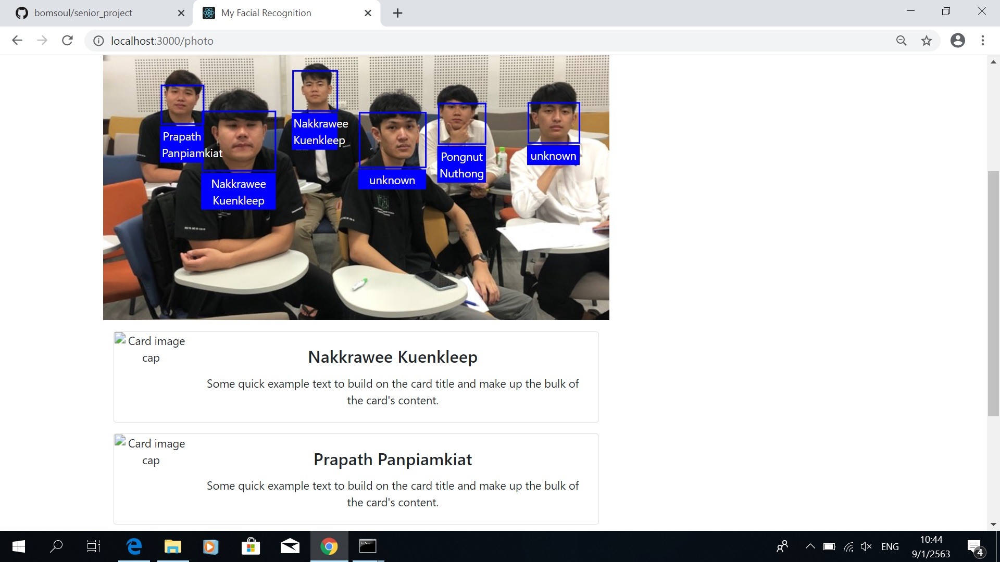

# I am Here (Senior Prject)

Web Application with Facial Recognition to check student attendent running in front-end browser using React and [face-api.js](https://github.com/justadudewhohacks/face-api.js) (with back-end NodeJS, ExpressJS and Firebase as a storage/database)



## Demo

**[Check out the Demo in Github Page](https://supachaic.github.io/bnk48-face-recognition/)**

## How to Run App in localhost

Clone the repository:

```bash
git clone https://github.com/bomsoul/senior_project.git
```

In the project directory, you need to run 2 cmd:
First CMD :
```bash
cd senior_project
npm start
```
Second CMD :
```bash
cd senior_project
cd backend
nodemon server
```

This will run app in development mode.
Open [http://localhost:3000](http://localhost:3000) to view it in the browser.

## How to create descriptors profile

This App uses descriptors profile of known faces (facial feature vector of 128 array of number) stored in JSON format as reference for face recognition. The sample profile of BNK48 current members (as of December 2018) is located in folder `src/descriptors/bnk48.json`

### API format

The API from ExpressJS contains student' name and array of 5-10 facial feature vector generate per member from sample photos. We don't store sample photos in the app to save processing time and optimize application size. You can create new descriptor (feature vector) by uploading photo to the app and add `Descriptors` to the database the descriptor.

API Format:

```text
{
  "STUDENT_1": {
    "name": "fullname",
    "descriptors": [
      [FEATURE_VECTOR],[FEATURE_VECTOR],...
    ],
	"imageURL" : "urllink",
	"stdID" : "studentID"
  },
  "STUDENT_2": {
    "name": "nickname",
    "descriptors": [
      [FEATURE_VECTOR],[FEATURE_VECTOR],...
    ],
	"imageURL" : "urllink",
	"stdID" : "studentID"
  },
  ...
}
```

Note:

- `MEMBER_1`, `MEMBER_2` are object keys to be referred by the App
- `nickname` will be displayed when app recognizes the face
- `FEATURE_VECTOR` is array of 128 number facial feature known as `descriptor` in face-api.js
- `ImageURL` is a string of image storage link.
- `stdID` is a string of student ID

## Somethings about face-api.js in this App

This project uses face-api.js for face-detection and face-recognition. The library comes with pre-trained face-detection models, SSD Mobilenet V1, Tiny Face Detector, and MTCNN. The default model is SSD Mobilenet V1, but I choose to use only Tiny Face Detector for its smaller size of weight.

The model weights are located in `public/models`. And the model functions are in `src/api/face.js`.

API start with function `loadModels` to loading models for face-detection, face-landmarks, and face-recognition with tiny face option.

```javascript
async function loadModels() {
  const MODEL_URL = process.env.PUBLIC_URL + '/models';
  await faceapi.loadTinyFaceDetectorModel(MODEL_URL);
  await faceapi.loadFaceLandmarkTinyModel(MODEL_URL);
  await faceapi.loadFaceRecognitionModel(MODEL_URL);
}
```

If you want to use SSD Mobilenet or MTCNN, you need to load new weight to `public/models`. You can find all of the weights in [face-api.js](https://github.com/justadudewhohacks/face-api.js) repo. And follow this [instruction](https://github.com/justadudewhohacks/face-api.js/blob/master/README.md#usage-loading-models) to load the correct model for your task.

Function `getFullFaceDescription` will accept image blob and return with full description (`Detection`, `Landmarks`, and `Descriptor`) of all faces detected in the image. I use Box information from `Detection` to draw face box. And use `Descriptor` to input in `faceMatcher` to find best match. (`Landmarks` are not used in this project)

```javascript
export async function getFullFaceDescription(blob, inputSize = 512) {
  // tiny_face_detector options
  let scoreThreshold = 0.5;
  const OPTION = new faceapi.TinyFaceDetectorOptions({
    inputSize,
    scoreThreshold
  });
  const useTinyModel = true;

  // fetch image to api
  let img = await faceapi.fetchImage(blob);

  // detect all faces and generate full description from image
  // including landmark and descriptor of each face
  let fullDesc = await faceapi
    .detectAllFaces(img, OPTION)
    .withFaceLandmarks(useTinyModel)
    .withFaceDescriptors();
  return fullDesc;
}
```

Function `createMatcher` accept `faceProfile` from `http://localhost:4000/fetch` as API that return JSON object to create `labeledDescriptors` of all members with their name and Descriptors arrays. The function then return `faceMatcher` with all labeled descriptors and display name. The maximum descriptor distance is set to 0.5 for more precise face recognition. (default is 0.6)

```javascript
export async function createMatcher(faceProfile) {
  // Create labeled descriptors of member from profile
  let members = Object.keys(faceProfile);
  let labeledDescriptors = members.map(
    member =>
      new faceapi.LabeledFaceDescriptors(
        faceProfile[member].name,
        faceProfile[member].descriptors.map(
          descriptor => new Float32Array(descriptor)
        )
      )
  );

  // Create face matcher (maximum descriptor distance is 0.5)
  let faceMatcher = new faceapi.FaceMatcher(
    labeledDescriptors,
    maxDescriptorDistance
  );
  return faceMatcher;
}

export function isFaceDetectionModelLoaded() {
  return !!faceapi.nets.tinyFaceDetector.params;
}
```

`faceMatcher` will be used in Component `DrawBox` to find best match if any face detected in the image.
File `src/components/drawBox.js`

```javascript
// if face detectec and found descriptors
match = await descriptors.map(descriptor => faceMatcher.findBestMatch(descriptor)
```

## License

MIT
